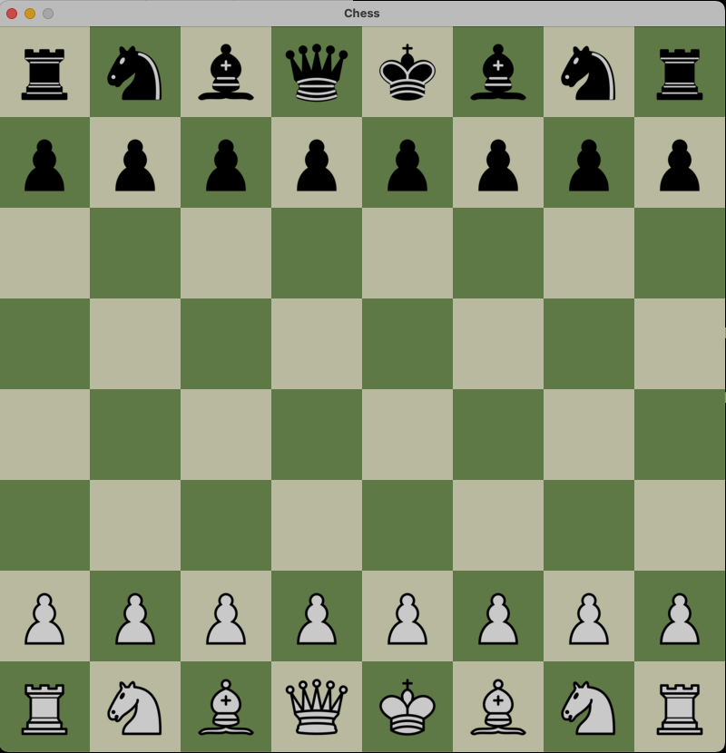

# Chess

This is a classic Player vs Player (PvP) chess game crafted in C++ using the Raylib library. My main motivation behind creating this project was to learn more about OOP concepts in C++. While making this game I learnt a lot about Classes, Objects. Differences between a shallow copy and a deep copy and a lot more.

## Screenshots



## Getting Started

To run the game, you will need to have the raylib library installed on your machine. Follow the instructions on the [raylib website](https://www.raylib.com) to install the library on your system.

Once you have raylib installed, clone this repository and navigate to the root directory. Add your Raylib installation directory in the makefile. Run the following commands to compile and launch the game:

```bash
$ make clean
$ make
$ ./bin/main
```

## Controls

- Use mouse keys to make your moves
- Press the 'Space Bar' key to restart the game.

## Pending features
1. Implement Casteling
2. Implement En Passant
3. Fix Bugs
4. Add AI


## Credits
This game was created using the raylib library. The raylib library is developed by [Raylib Team](https://github.com/raysan5/raylib#development-and-contributors).